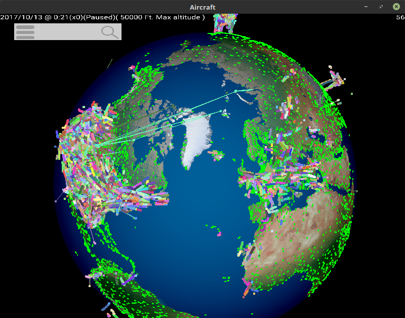

# Displaying Aircraft Movements & Positions

Welcome to Group 20's Aircraft Movements & Positions Repository

This project is about mapping real world air traffic data onto a 3D visualisation of the earth. This will require sourcing the data, building a program with which to view the visualisation, and providing a smooth user experience for the end user.

### **Team members:**

Emmanuel Papadakis. Email: [psyep1@nottingham.ac.uk](mailto:psyep1@nottingham.ac.uk)

Hugo Ozanne. Email: [psyho1@nottingham.ac.uk](mailto:psyho1@nottingham.ac.uk)

Joel Cox. Email: [psyjc5@nottingham.ac.uk](mailto:psyjc5@nottingham.ac.uk)

Norah Alageel. Email: [psyna3@nottingham.ac.uk](mailto:psyna3@nottingham.ac.uk)

Ruiyi Lin. Email: [psyrl5@nottingham.ac.uk](mailto:psyrl5@nottingham.ac.uk)

Rumyana Cherneva. Email: [psyrc5@nottingham.ac.uk](mailto:psyrc5@nottingham.ac.uk)

Zhi Fu Lim. Email: [psyzfl@nottingham.ac.uk](mailto:%20psyzfl@nottingham.ac.uk)

### **Supervisor:**

Dr Jason Atkin. Email: [jason.atkin@nottingham.ac.uk](mailto:jason.atkin@nottingham.ac.uk)

### **Software requirements**:

Builds target windows 10.

### **Hardware requirements**:

Any x86-64 computer with OpenGL 3.3+ support

1GB spare disk space for binaries and assets as well as additional disk space for any input datasets

8GB of RAM is recommended, but larger amount of RAM can hold larger data sets.

### **How to build from source**:

On Windows:

Run `build-windows-testing.bat` in the /src folder, then run `testing-airport-renderer-windows.exe` from the /bin folder. If build passes, proceed.

Run `build-windows.bat` in the /src folder, which can be ran from a command line to show errors/warnings that may occur.

On Mac:

Run `build-mac-testing.sh` in the /src folder, then run `testing-airport-renderer-mac.o` from the /bin folder. If build passes, proceed.

Run `build-mac.sh` in the /src folder, which can be ran from the terminal.

On Linux:

Run `make clean; make test` in the /src folder, which can be ran from the terminal, then run `testing-airport-renderer-linux.elf` from the /bin folder. If build passes, run `make`.

### **How to run**:

On Windows:

Run `airport-renderer-windows.exe` in the /bin folder.

On Mac:

Run `airport-renderer-mac.o` in the /bin folder, which can be ran from the terminal.

On Linux:

Run `airport-renderer-linux.elf` in the /bin folder, which can be ran from the terminal.

### **Trello board:**

https://trello.com/group2015

### **Documentation:**

Documentation can be found in the git repo, at /Documentation/ folder.

### **User Manual**

The User Manual can be found in the Documentation folder.

### **Important Note:** 

Check the comments for the commits, if pair coding was done, they will include the group members who worked on the code/documentation.
